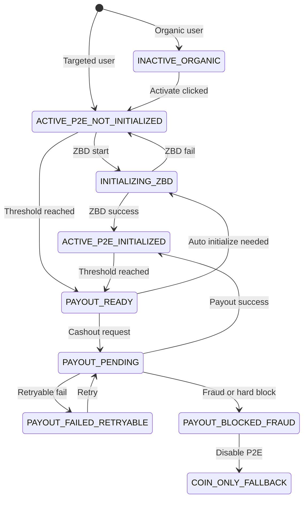

# ZBD P2E State Diagram v1

Bu dokuman ekip ici hizli paylasim icin sade state diagram icerir.

## 1. Simple State Flow



## 2. Reading Notes

- `INACTIVE_ORGANIC`: oyuncu coin flow'da, earn sistemi aktif degil.
- `ACTIVE_P2E_NOT_INITIALIZED`: earn aktif ama ZBD setup tamam degil.
- `ACTIVE_P2E_INITIALIZED`: earn aktif, wallet ve payout hazir.
- `PAYOUT_READY`: threshold veya minimum withdrawable kosulu saglandi.
- `PAYOUT_PENDING`: provider request gitti, sonuc bekleniyor.
- `PAYOUT_FAILED_RETRYABLE`: tekrar denenebilir teknik hata.
- `PAYOUT_BLOCKED_FRAUD`: fraud ya da provider block.
- `COIN_ONLY_FALLBACK`: guvenlik nedeniyle P2E kapatildi.

## 3. Reward and Balance Layer

State diagram tek basina yeterli degil; alttaki rule hep akilda tutulmali:

```text
reward calculation != wallet display != payout transfer
```

Bu nedenle:

- Kullanici 10.7 unit kazanmis olabilir
- Wallet 10.7 unit gosterir
- Cashout sadece 10 unit gonderebilir

## 4. Suggested Miro Frame Labels

- Entry Source
- Activation
- Initialization
- Threshold
- Cashout
- Failure / Fraud
- Fallback
